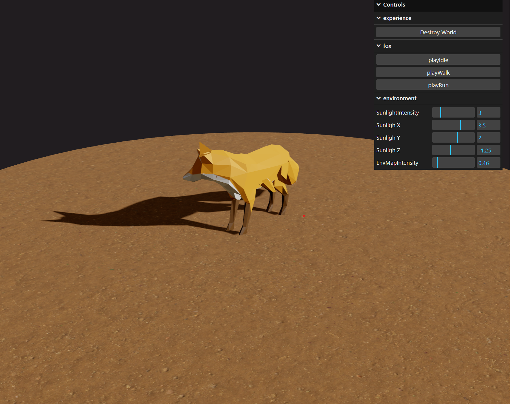

# Three.js Journey

## Setup
Download [Node.js](https://nodejs.org/en/download/).
Run this followed commands:

``` bash
# Install dependencies (only the first time)
pnpm install

# Run the local server at localhost:5173
pnpm run dev

# access with debug at localhost:5173/#debug



# Build for production in the dist/ directory
pnpm run build
```

